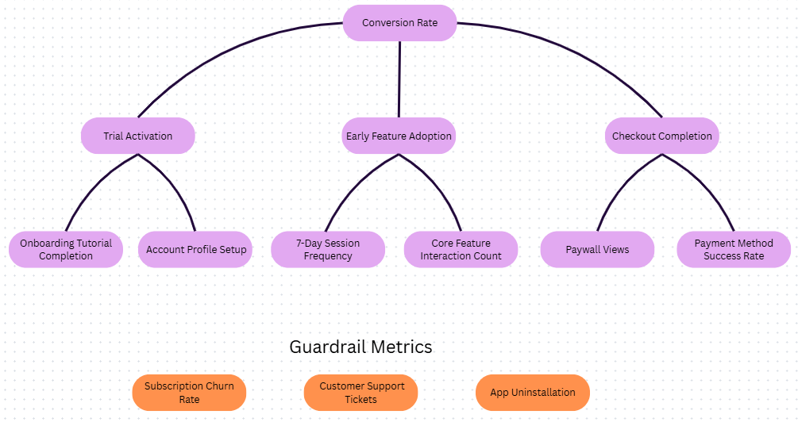
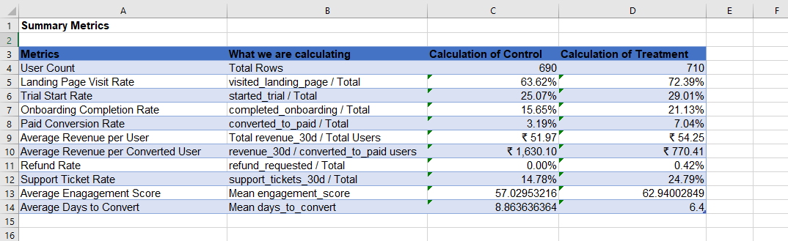
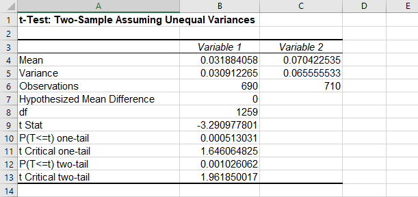

# Part 2: KPI Framework, Business Experiment Analysis & Decision Recommendation
### Business Problem Statement/Business Context
**What decision needs to be made?**  
To decide whether the company should permanently implement the new onboarding experience to all customers and deprecate the old onboarding experience, or not.  

**Who the decision impacts?**  
- **New users -** People who directly experience the new or old onboarding experience.
- **Product and Marketing teams -** who are responsible for maintaining and optimizing the user experience.
- **Customer Support team -** who are affected by any negative experience or problems from the customers.  

**What metric should improve?**  
- **Conversion Rate -** the number of new users who successfully transition to the subscription after the onboarding experience.
- **Customer Engagement -** the average interaction frequency of the user with the product.  

**What risks must be monitored?**  
- **Churn/Cancellation rates -** to ensure the new campaign does not make customers to cancel their subscriptions early.
- **Customer Support Tickets -** to monitor support requests, which would show if the new onboarding campaign is confusing or has technical difficulties.  

**What evidence is required before making a recommendation?**  
- **Statistical proof -** a 2 sample hypothesis test showing improvement in primary metrics and achieving a p-value less than alpha (0.05).
- **Financial proof -** to show that the change will make enough profits to make it worth the effort.  
______
### Dataset Description
`campaign_experiment_data.xlsx` dataset is used for this experiment.  
- **Total Sample Size:** 1,400 unique user records (after removinging 8 duplicate records).
- **Group Distribution:**  
    - Control Group: 690 users
    - Treatment Group: 710 users  

#### Data Handling:
| Column | Attribute | Values | Any Issues Found and Fixed |
| :---: | :---: | :---: | :---: |
| A | user_id | Unique IDs | 16 duplicate user_ids found. 8 records removed. |
| B | signup_date | Dates (YMD) |  |
| C | experiment_group | Control/Treatment |  |
| D | region | East/West/North/South |  |
| E | device_type | Desktop/Mobile/Tablet/Unknown | 18 Blanks were present. These blanks are filled with "Unknown" |
| F | traffic_source | Email/Organic/Paid Search/Referral/Social/Unknown | 24 blanks were present. These blanks are filled with "Unknown" |
| G | plan_type | Free/Basic/Premium |  |
| H | visited_landing_page | Binary (0/1) |  |
| I | started_trial | Binary (0/1) |  |
| J | completed_onboarding | Binary (0/1) |  |
| K | converted_to_paid | Binary (0/1) |  |
| L | revenue_30d | Numbers |  |
| M | support_tickets_30d | Integers (0 - 4) |  |
| N | refund_requested | Binary (0/1) |  |
| O | days_to_convert | Integers | 1336 Blanks present. No action taken |
| P | engagement_score | Numbers (0 - 100) | 14 Blanks present. No action taken |
_______
### North Star Metric
**Paid Conversion Rate**  
The percentage of new customers who convert to a paid subscription.
_______
### KPI Tree Summary

**The North Star:** Paid Conversion Rate  

**Driver 1:** Trial Activation  
**Sub-drivers:** Onboarding tutorial completion and Account profile setup.

*Explanation: We look at Trial Activation because a user can't convert if they never actually start using the app. We measure this by checking if they finished the tutorial and set up their profile. If these two metrics increase, it means more users are actively engaging with the product, which gives a higher chance of converting later.*  

**Driver 2:** Early Feature Adoption  
**Sub-drivers:** 7-day session frequency and core feature interaction count

*Explanation: We show the new users some premium features as a sample for the users to try out. If they keep coming back and using the features frequently in the 7 days, it means they like it and are finding it useful. Which can mean that the users can potentially pay for the subscription*  

**Driver 3:** Checkout completion  
**Sub-drivers:** Paywall views and payment method success rate.

*Explanation: We see how many users looked at the subscription prices. If they look further into the subscriptions, it means they are thinking of buying it. Or at least looking at what more we have to offer. Then we see how many actually buy a subscription and successfully complete the transaction.*
__________
### Experiment Analysis Approach
1. **Data Cleaning:** 8 duplicate records were removed and filled in missing demographic data with "Unknown" classification.
2. **North Star Metric:** **Paid Conversion Rate** is chosen as the primary metric.
3. **Statistical Modeling:** Created a summary of Control vs Treatment groups over 11 metrics. Conducted a Two-Sample t-Test Assuming Unequal Variances on our primary binary outcome metric, converted_to_paid.  

4. **Guardrail Framework:** Evaluated operational metrics (support tickets) and financial indicators (revenue quality) alongside the primary metric to perform a cost analysis.
_________
### Hypothesis Test Summary

Tested the primary metric, **Paid Conversion Rate**, using Two-Sample t-Test Assuming Unequal Variances.
- **Null Hypothesis ($H_0$):** $Conversion_{Treatment} = Conversion_{Control}$ (The new onboarding has no real effect).
- **Alternate Hypothesis ($H_a$):** $Conversion_{Treatment} \neq Conversion_{Control}$ (The onboarding creates a significant change).
- **Significance Level ($\alpha$):** 0.05

**Test Results:**
- **Control Onboarding:** 3.19% conversion
- **Treatment Onboarding:** 7.04% conversion
- **Calculated t-Stat:** -3.29
- **Calculated P-Value:** 0.001026

Since the calculated p-value (0.001026) is significantly lower than the alpha threshold (0.05), we reject the Null Hypothesis. The data proves that the onboarding campaign successfully doubled the paid conversion.
__________
### Guardrail Metrics Considered
1. **Support Ticket Rate has increased.** In the Segment 3 (Support Ticket Rate by Traffic Source) pivot table, in the Control group, only 102 users out of 690 filed support tickets (14.8%). In the Treatment group, it increased to 176 users out of 710 (24.8%). Even though more people are converting, more pweople are getting confused or asking for help.

2.  **Refunds Have Appeared.** In the Control group, the refund rate was 0%. In the Treatment group, it increased to 0.42%. Though it's still small, but it shows some users felt unsatisfied or felt tricked into converting.

3. **Average Revenue Per Converted User cereased by Half.** Control converted users spent ₹1,630.10 each on average. Treatment converted users spent only ₹770.41 each. The old onboarding was tough, so only high-paying, high-intent users paid for it. The new onboarding made it easier to subscribe, so more of cheaper plan users signed up.
________
### Final Recommendation
The new onboarding should be **launched only for selected segment.**  
- The new onboarding should be launched for Mobile and Tablet users in the East and West regions, since the campaign is successful here. This shows the new onboarding design is more responsive and optimized for mobile devices.
- For the North and South regions we should hold or exclude Launch. The campaign's messaging or pricing framework failed to resonate in here and would damage revenue if launched right away.
________
### Assumptions and Limitations
1. **Statistical Assumptions:**
    - ***Independence of Observations:*** We assume that the behavior of one user had absolutely zero effect on the behavior of another user.
    - ***Continuous or Binary Metrics:*** For the t-test on conversion, we assume the metric can be evaluated as a continuous proportion.
    - ***Representative Sampling:*** We assume that the 1,400 users in this dataset are a fair, random selection of the company's overall future user base.

2. **Experimental Design Assumptions:**
    - ***Homogeneity of Time:*** We assume that both the Control group and the Treatment group were running at the exact same time.
    - ***No External Influences:*** We assume there were no external factors that disproportionately affected one group over the other.

3. **Data Integrity Assumptions:**
    - ***Blanks in Conversion:*** In the days_to_convert column, there were 1,336 blank rows. We assume that a blank strictly means that the user never bought a paid subscription.
    - ***Randomness of Missing Engagement Scores:*** There were 14 missing entries in the engagement_score column. We assume that the system systematically failed to record scores for some users (a glitch).
    - ***"Unknown" Demographics:*** For the blanks in device_type and traffic_source, we assume that categorizing them as "Unknown" allows us to keep their conversion numbers without skewing or corrupting the other distributions of the known segments.

4. **Business Assumptions:**
    - ***The 30-Day Extrapolation:*** We assume that users behavior in their first 30 days is an accurate predictor of their long-term value.

________